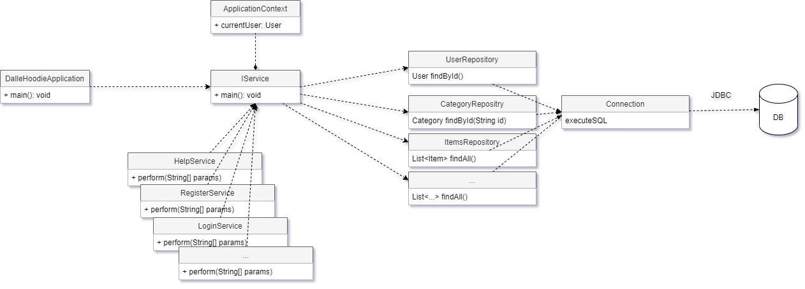

# DALLE-HOODIE

## Описание

DALLE-HOODIE (v0.1) - тестовое консольное приложение, позволяющее делать тестовые заказы в локальной БД посредством текстовых комманд, вводимых в том же терминале, где запущено само приложение.

## Запуск программы

Программа запускается из коммандной строки с предоставление входных параметров:

java -jar dalle-hoodie.jar

В результате программа выведет приветсвие и придложет ввести одну и команд, либо выйти.

Сама же программа при запуске инстанцирует все нужные объекты, и объект контекст исполнения.

## Исполнение программы

Программа в бесконечном цикле просит пользователя ввести одну из возможножных комманд, перечисленных ниже, с требуемыми параметрами.
На каждую команду есть свой обработчик, который связывается с БД, и выполняеть какую то логику с данными. 
При этом Программа во время исполнения хранит некий контекст - объект-кеш состояния исполнения программы. 
Например(что пользователь залогинился, храним его ID). По выходу из программы весь контекст само собой удаляется.

### Список комманд

```
help // вывести справку и список комманд
register LOGIN PASSWORD // создать нового пользователя
login LOGIN PASWORD // авторизоваться в системе. 
categories    // выводит список категорий
category CATEGORY_ID // выводит список позиций в категории
item ITEM_ID // выводит более подробную инфу по позиции
profile // выводит инфу о текущем залогиненом пользователе
order  // вывести текущий ордер (корзину), который со статусом DRAFT, если его еще нет, то создаст автоматов пустой
orders  // вывести список проведенных ордеров
order-item ID_item // добавить в ордер позицию

exit  // выйти
```


## Хранение данных

Все данные хранятся в рядом стоящей БД postgresql, а программа подключается посредством JDBC драйвера, а точнее библиотеки postgresql-connector (https://habr.com/ru/post/326614/)

На каждую таблицу есть свой класс, описывающий данные конкретной коллекции сущностей, а также класс-сервис(репозиторий), инкапсулирующий логику запросов к БД по каждой отдельной сущности 
```
class User {
 private int user_id;
 private String name;
 private String email;
 private String password
}

class UserRepository {
  
  void create(User user) {
     // код запроса в БД
  }
  void update(User user) {
   // код запроса в БД
  }
  User findByLogin(String login) {
   // код запроса в БД
  }
  
  User findById(int id) {
   // код запроса в БД
  }

}
```

При этом сервисы, обработчики команду будут использовать объекты данных классов-репозиторией для запросов/изменений сущностей в БД.


## Архитектура программы




